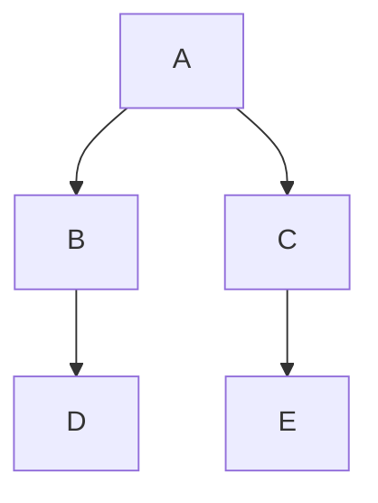

# devim


### Common vim plugins needed:

Common tools:

    * NERDTree
    * BufOnly
    * grep
    * ctrlp
    * vim-airline
    * vim-bufferline

Shell tools:

    * vimproc.vim
    * vimshell.vim

### Development

#### Common vim plugins needed:

* vim-fugitive : Plugin is used as git tools in git.
* TagBar
* Matchit
* nerdcommenter
* Syntastic
* vim-autoformat
* dash

#### Javascript 

##### VIM Plugins

* vim-jsbeautify

##### Supporting utility plugin:

#### react

* vim-jsx

    ```
    let g:jsx_ext_required = 0 " Allow JSX in normal JS files
    ```

#### Plugins needed:

#### HTML

* vim-php-cs-fixer
* vim-css-color

#### C/C++

    * a.vim
    * cscope.vim

1. Install plugin:

Oplibs development env config.
abd newword


**Markdown Extra** has a special syntax for tables:

Item     | Value
-------- | ---
Computer | $1600
Phone    | $12
Pipe     | $1

You can specify column alignment with one or two colons:

| Item     | Value | Qty   |
| :------- | ----: | :---: |
| Computer | $1600 |  5    |
| Phone    | $12   |  12   |
| Pipe     | $1    |  234  |

<script type="text/javascript" src="https://cdn.mathjax.org/mathjax/latest/MathJax.js?config=TeX-AMS_HTML"></script>

$S=\pi r^2$


" Shell utils

" Plugin 'SirVer/ultisnips'
" Plugin 'honza/vim-snippets'

"Plugin 'powerline/powerline'

"Plugin 'easymotion/vim-easymotion'
Plugin 'ervandew/supertab'

Plugin 'mattn/emmet-vim'

"Plugin for developing of C and CPP


Plugin 'evanmiller/nginx-vim-syntax'

"Plugin for markdown
"Plugin 'godlygeek/tabular'
"Plugin 'plasticboy/vim-markdown'
"Plugin 'spf13/vim-preview'
"Plugin 'iamcco/markdown-preview.vim'

" Plugin 'tyru/open-browser.vim'

"Plugin 'xolox/vim-misc'
"Plugin 'xolox/vim-notes'

"Plugin task
Plugin 'itchyny/calendar.vim'

Plugin 'tomasr/molokai'
"Plugin 'altercation/vim-colors-solarized'
