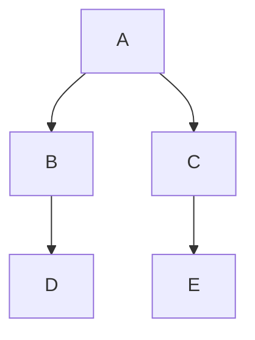

# devim

## Pre-install

* vim8
* python
* vundle (git clone https://github.com/VundleVim/Vundle.vim.git ~/.vim/bundle/Vundle.vim)

## Requirements

* the_silver_searcher
* ctags
* cscope
* cmake
* astyle
* autopep8
* flake8

### Common vim plugins needed:

Common tools:

    * NERDTree
    * BufOnly
    * grep
    * ctrlp
    * vim-airline
    * vim-bufferline

Shell tools:

    * vimproc.vim
    * vimshell.vim

### Development

#### Common vim plugins needed:

* vim-fugitive : Plugin is used as git tools in git.
* TagBar
* Matchit
* nerdcommenter
* Syntastic  javascript  npm install -g eslint-config-airbnb eslint-plugin-import eslint-plugin-react eslint-plugin-jsx-a11y eslint
* vim-autoformat
* dash

#### Javascript

##### VIM Plugins

* vim-jsbeautify

##### Supporting utility plugin:

#### react

* vim-jsx

    ```
    let g:jsx_ext_required = 0 " Allow JSX in normal JS files
    ```

#### Plugins needed:

#### HTML

* vim-css-color

#### C/C++

    * a.vim
    * cscope.vim

1. Install plugin:

Oplibs development env config.
abd newword


**Markdown Extra** has a special syntax for tables:

Item     | Value
-------- | ---
Computer | $1600
Phone    | $12
Pipe     | $1

You can specify column alignment with one or two colons:

| Item     | Value | Qty   |
| :------- | ----: | :---: |
| Computer | $1600 |  5    |
| Phone    | $12   |  12   |
| Pipe     | $1    |  234  |
