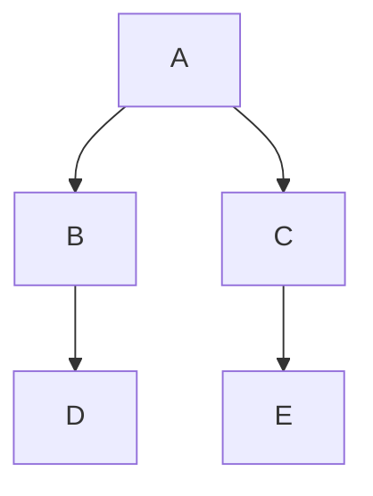

# devim


## Javascript

### Common vim plugins needed:

* NERDTree

* BufOnly

* grep

* ctrlp

* TagBar

* Matchit

* nerdcommenter

#### Javascript 

##### VIM Plugins

* vim-jsbeautify

* Syntastic

* vimproc.vim

* vimshell.vim

##### Supporting utilities

#### react

* vim-jsx

    ```
    let g:jsx_ext_required = 0 " Allow JSX in normal JS files
    ```

#### Plugins needed:

1. Install plugin:


Oplibs development env config.
abd newword


Plugin 'tpope/vim-fugitive'

" Shell utils

" 加入nerdcommenter
Plugin 'scrooloose/nerdcommenter'

" Plugin 'SirVer/ultisnips'
" Plugin 'honza/vim-snippets'

"Plugin 'powerline/powerline'
Plugin 'bling/vim-airline'
Plugin 'bling/vim-bufferline'

"Plugin 'easymotion/vim-easymotion'
Plugin 'ervandew/supertab'

Plugin 'scrooloose/syntastic'
Plugin 'mattn/emmet-vim'

Plugin 'mxw/vim-jsx'

"Plugin for developing of C and CPP
Plugin 'a.vim'
Plugin 'brookhong/cscope.vim'

Plugin 'Chiel92/vim-autoformat'

Plugin 'stephpy/vim-php-cs-fixer'
Plugin 'maksimr/vim-jsbeautify'
" Plugin 'einars/js-beautify'

Plugin 'ap/vim-css-color'

Plugin 'evanmiller/nginx-vim-syntax'

"Plugin for markdown
"Plugin 'godlygeek/tabular'
"Plugin 'plasticboy/vim-markdown'
"Plugin 'spf13/vim-preview'
"Plugin 'iamcco/markdown-preview.vim'

" Plugin 'tyru/open-browser.vim'

"Plugin 'xolox/vim-misc'
"Plugin 'xolox/vim-notes'

" dash for help
Plugin 'rizzatti/dash.vim'

"Plugin task
Plugin 'itchyny/calendar.vim'

Plugin 'tomasr/molokai'
"Plugin 'altercation/vim-colors-solarized'


